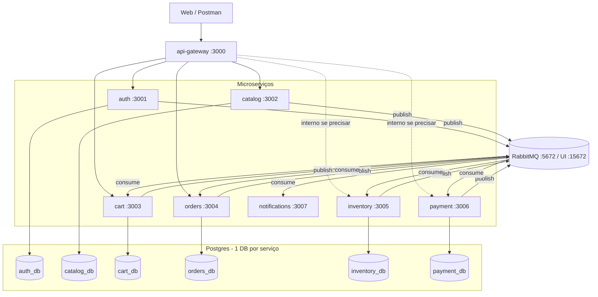
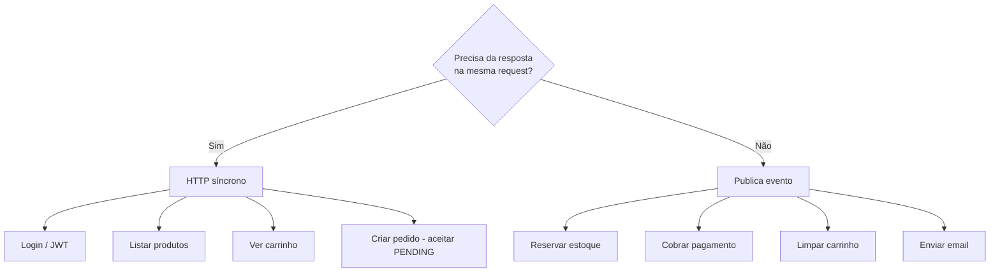
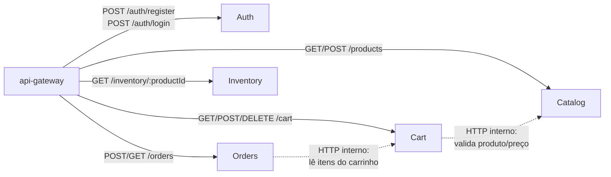
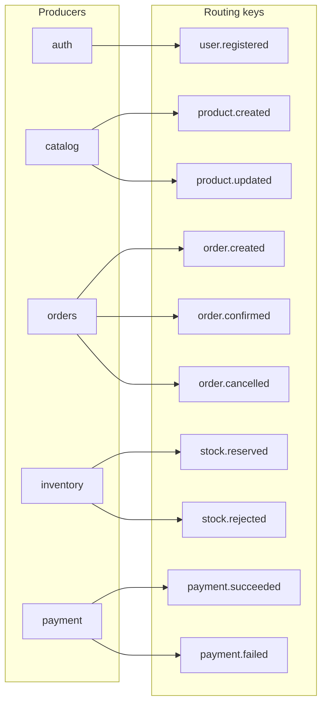
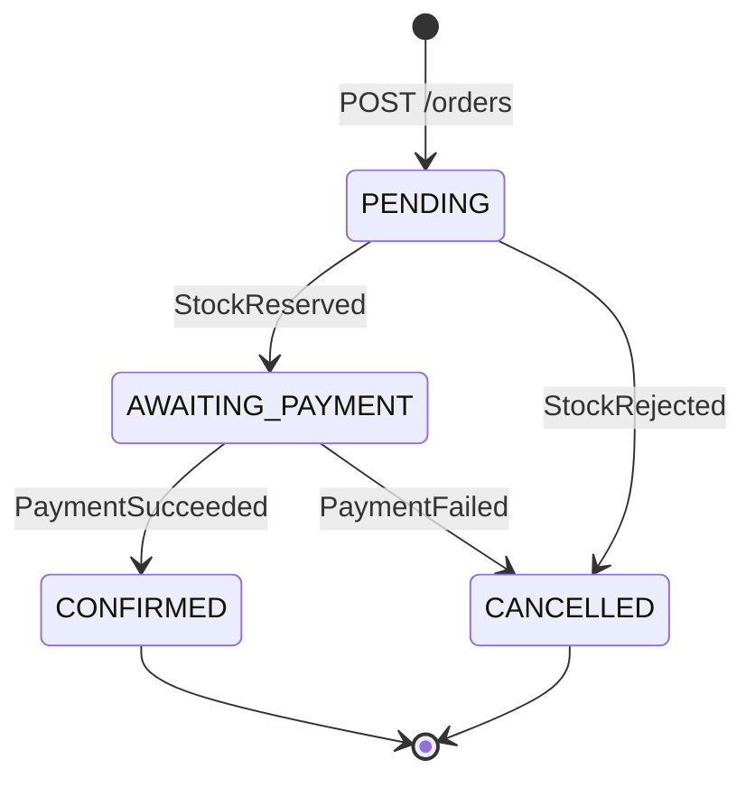
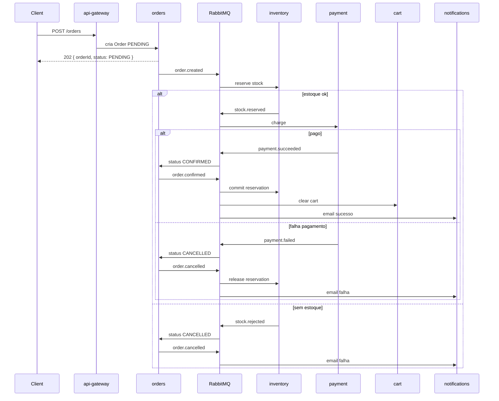

# Ecommerce — Arquitetura

Projeto de estudo: ecommerce com **microserviços** + **RabbitMQ**.  
O “overkill” é intencional — o objetivo é aprender padrões, não minimizar infra.

Documento vivo: atualize este arquivo quando decisões de arquitetura mudarem.

---

## Decisões fechadas

| Decisão | Escolha |
|---------|---------|
| Broker | **RabbitMQ** (topic exchange `ecommerce.events`) |
| Escopo | **8 serviços** + lib compartilhada `auth-middleware` |
| Saga de checkout | **Coreografia** (sem orchestrator central) |
| Stack por serviço | Node.js + TypeScript + Express + Prisma + Postgres |
| Comunicação | HTTP síncrono para request/response; eventos para efeitos colaterais |
| Checkout | Resposta assíncrona (`202 PENDING` → eventos) |
| Dados | **1 Postgres (database) por serviço** — sem DB compartilhado |

---

## Mapa de serviços



### Responsabilidades e portas

| Serviço | Porta | DB | HTTP (via gateway) | Consome eventos |
|---------|-------|-----|--------------------|-----------------|
| **api-gateway** | 3000 | — | proxy + valida JWT | — |
| **auth** | 3001 | auth_db | register, login | — |
| **catalog** | 3002 | catalog_db | CRUD produtos | — |
| **cart** | 3003 | cart_db | add/remove/list | `order.confirmed` → limpa |
| **orders** | 3004 | orders_db | criar/listar pedido | `stock.*`, `payment.*` |
| **inventory** | 3005 | inventory_db | consultar estoque | `order.created`, `order.cancelled`, `payment.failed`, `order.confirmed` |
| **payment** | 3006 | payment_db | — (interno) | `stock.reserved` |
| **notifications** | 3007 | — | — | `order.confirmed`, `order.cancelled`, `user.registered` |

`auth-middleware` é **pacote compartilhado** (verificação JWT), não um microserviço.

`notifications` e `api-gateway` não precisam de banco no início.

---

## Quando usar HTTP vs fila



### Chamadas HTTP síncronas



Regra: efeitos em outro domínio **depois** de aceitar o pedido → **fila**, não HTTP encadeado longo.

---

## Contratos de eventos (RabbitMQ)

- **Exchange:** `ecommerce.events`
- **Tipo:** `topic`
- **Routing keys:** ver tabela abaixo

| Routing key | Publisher | Payload (essencial) | Consumers |
|-------------|-----------|---------------------|-----------|
| `user.registered` | auth | `{ userId, username }` | notifications |
| `product.created` | catalog | `{ productId, name, price }` | inventory (cria stock=0) |
| `product.updated` | catalog | `{ productId, price? }` | — (futuro) |
| `order.created` | orders | `{ orderId, userId, items[] }` | inventory |
| `stock.reserved` | inventory | `{ orderId, reservationId }` | payment |
| `stock.rejected` | inventory | `{ orderId, reason }` | orders |
| `payment.succeeded` | payment | `{ orderId, paymentId }` | orders |
| `payment.failed` | payment | `{ orderId, reason }` | orders, inventory (libera reserva) |
| `order.confirmed` | orders | `{ orderId, userId }` | cart, notifications, inventory (commit reserva) |
| `order.cancelled` | orders | `{ orderId, reason }` | notifications, inventory (libera reserva) |

### Mapa producers → eventos



---

## Saga do checkout (coreografia)

O cliente **não espera** o saga inteiro: recebe `202` com `status: PENDING` e consulta `GET /orders/:id`.

### Estados do pedido



### Sequência



---

## Estrutura do monorepo (alvo)

```
ecommerce/
├── docker-compose.yml
├── package.json                 # workspaces (opcional)
├── packages/
│   └── auth-middleware/         # lib JWT — NÃO é serviço
├── services/
│   ├── api-gateway/
│   ├── auth/                    # existe hoje na raiz (mover)
│   ├── catalog/
│   ├── cart/
│   ├── orders/
│   ├── inventory/
│   ├── payment/
│   └── notifications/
└── docs/
    ├── architecture.md          # este arquivo
    ├── roadmap.md
    └── current-state.md
```

Cada serviço: Express + Prisma + Postgres próprio + publisher/consumer RabbitMQ.

---

## Compose raiz (esqueleto)

```yaml
services:
  rabbitmq:
    image: rabbitmq:3-management
    ports: ["5672:5672", "15672:15672"]

  auth-db:
  catalog-db:
  cart-db:
  orders-db:
  inventory-db:
  payment-db:

  auth:
  catalog:
  cart:
  orders:
  inventory:
  payment:
  notifications:
  api-gateway:
```

Preferência pedagógica: **um container Postgres por serviço** (ou um Postgres com vários databases, se o Compose ficar pesado demais no início).

---

## Princípios do projeto

1. **Um bounded context = um serviço = um banco.**
2. **HTTP para pergunta/resposta; eventos para “aconteceu X”.**
3. **Checkout assíncrono** — aceitar rápido, processar via fila.
4. **Saga coreografada** — cada serviço reage a eventos e publica o próximo.
5. **Overkill intencional** — priorizar aprendizado de padrões sobre simplicidade.
6. **Idempotência nos consumers** — processar o mesmo evento duas vezes não deve corromper estado (meta da fase de polish).

---

## Referências internas

- [Roadmap de implementação](./roadmap.md)
- [Estado atual do código](./current-state.md)
